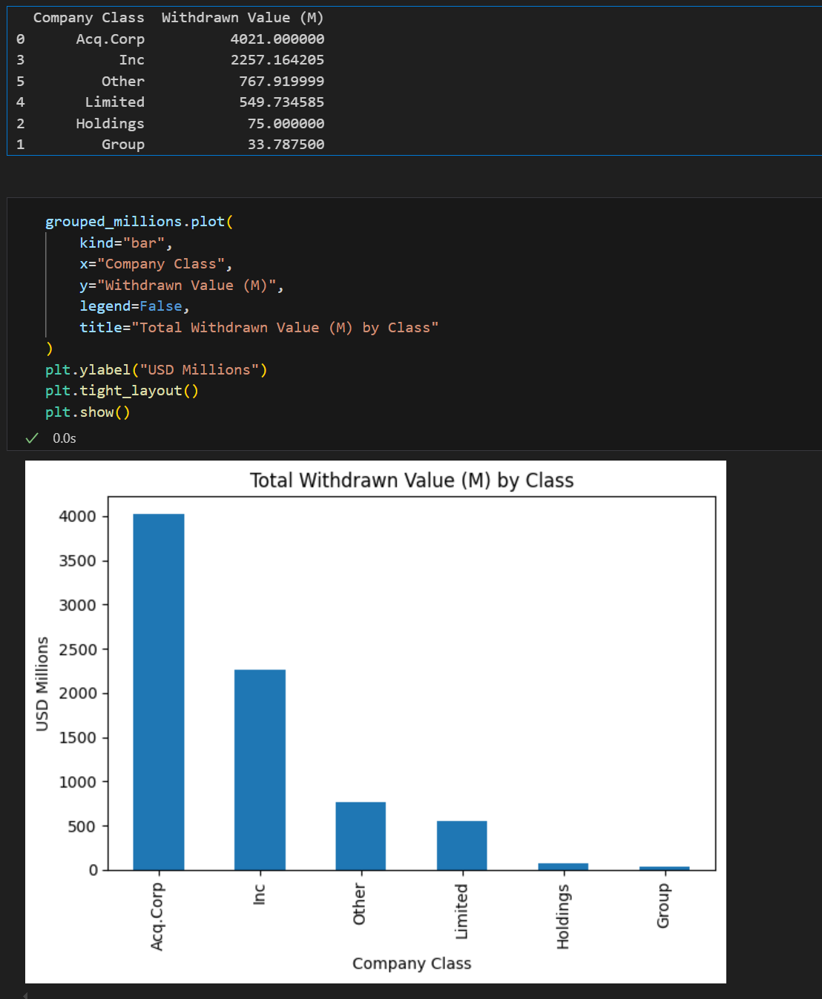
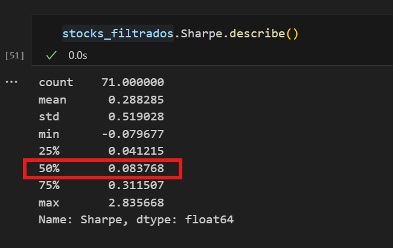
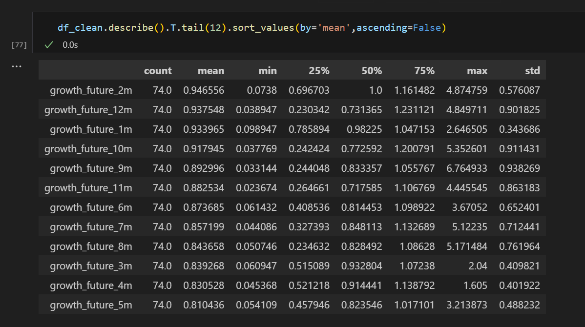

# Question 1: [IPO] Withdrawn IPOs by Company Type

## Q1. Solution

* What is the total withdrawn IPO value (in $ millions) for the company class with the highest total withdrawal value?

* 4021

# Question 2: [IPO] Median Sharpe Ratio for 2024 IPOs (First 5 Months)

## Q2. Solution

* What is the median Sharpe ratio (as of 6 June 2025) for companies that went public in the first 5 months of 2024?

* 0.08

# Question 3: [IPO] ‘Fixed Months Holding Strategy’

## Q3. Solution

* What is the optimal number of months (1 to 12) to hold a newly IPO'd stock in order to maximize average growth?

* 2

