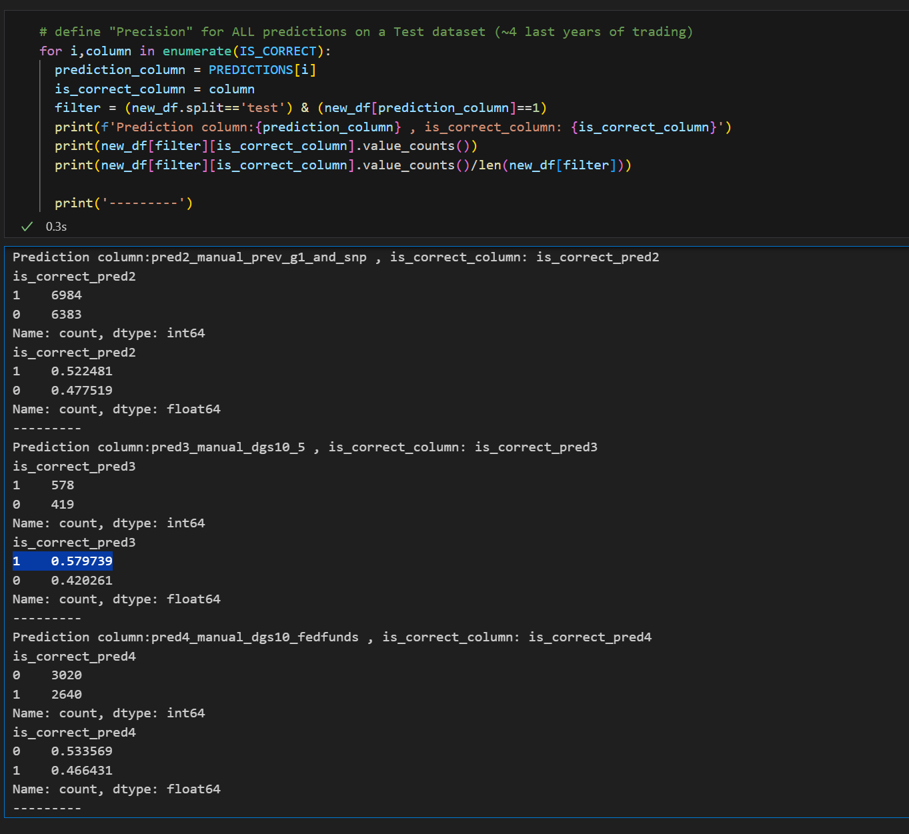

# Homework Solution

## Question 1: Dummies for Month and Week-of-Month

What is the ABSOLUTE CORRELATION VALUE of the most correlated dummy variable _w<week_of_month> with the binary outcome is_positive_growth_30d_future?

### Q1. Solution

* month_wom_October_w4 = 0.025

## Question 2: Define New "Hand" Rules on Macro and Technical Indicator Variables

What is the precision score for the best of the NEW predictions (pred3 or pred4), rounded to 3 digits after the comma?

### Q2 Solution

* 0.580

